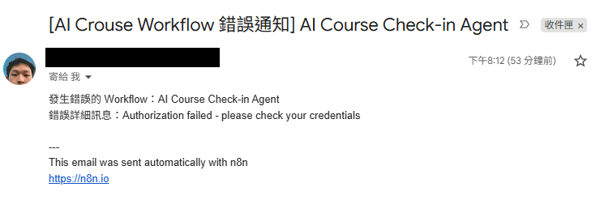
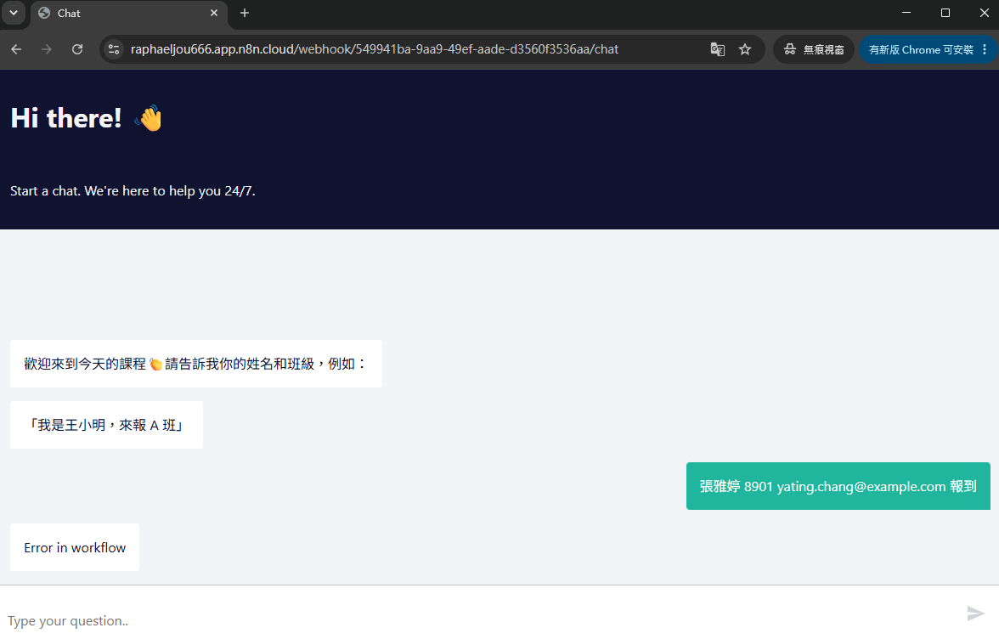
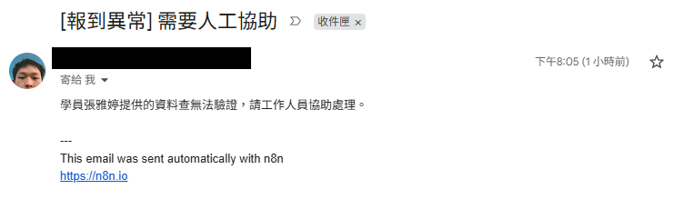
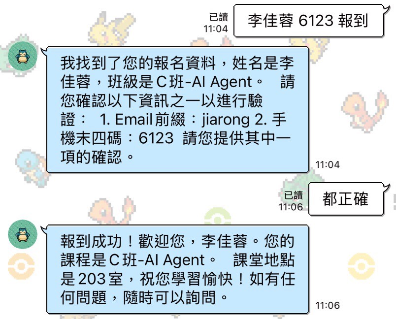

# AI Course Check-in Agent

用 n8n + GPT-4o-mini 做的對話式課程報到系統,學員傳一句話就能完成報到,異常狀況會自動寄信通知工作人員。

## Demo


實測影片:[docs/video/n8n-demo.mp4](docs/video/n8n-demo.mp4)

## 亮點

- **對話式報到**:學員不用填表單,直接用一句話(例如「我是王小明,來報 A 班」)跟 Chat Agent 對話完成報到
- **姓名模糊比對**:容錯錯字、簡繁差異、空格,不用打出跟資料庫一模一樣的姓名
- **異常自動通報**:驗證三次失敗或查無資料,自動寄 Gmail 通知工作人員人工處理
- **錯誤監控**:獨立的 Error Trigger workflow 監聽整個系統的執行錯誤,崩潰時第一時間收到通知
- **LINE 官方帳號整合**:學員可直接在 LINE 對話完成報到,不用切換到瀏覽器

## 技術棧

| 項目       | 使用工具            |
| ---------- | ------------------- |
| 自動化平台 | n8n Cloud           |
| 語言模型   | OpenAI GPT-4o-mini  |
| 資料儲存   | Google Sheets       |
| 通知管道   | Gmail               |
| 對話介面   | n8n Chat Trigger    |
| 訊息平台   | LINE Messaging API  |

## 系統架構

LINE 和原本的 n8n Chat UI 是兩個獨立入口,LINE 的訊息會先經過一個橋接 workflow 轉換格式,再送進同一個報到主 workflow 處理。

```
      [n8n Chat UI]        [LINE 官方帳號]
            │                      │
            │                      ▼
            │            [LINE Chat Bridge Workflow]
            │            Webhook → Code → IF → Execute Sub-workflow → HTTP Reply
            │                      │
            └──────────────────────┤
                                   ▼
                        [AI Course Check-in Agent]
                                   │
                    ┌──────────────┼──────────────┐
                    ▼              ▼              ▼
                Google Sheets   Gmail 通知    (未來:LINE Push)

              ⚠️ 錯誤時 → Error Handler Workflow → Gmail 告警
```

細節記錄在 [docs/architecture.md](docs/architecture.md)。

## 專案結構

```
n8n-course-checkin-agent/
├── README.md
├── .gitignore
├── .env.example
├── docs/
│   ├── ai-agent-prompt.md
│   ├── architecture.md
│   ├── line-integration-notes.md
│   └── screenshots/
├── workflows/
│   ├── ai-checkin-agent.md
│   ├── error-handler.md
│   └── line-chat-bridge.md
└── data/
    └── sample-data.md
```

## 快速開始

1. 到 n8n Cloud 建一個新專案,把 `workflows/ai-checkin-agent.md` 和 `workflows/error-handler.md` 裡的 JSON 分別匯入(Settings → Import from File)
2. 複製 `.env.example` 為 `.env`,填入自己的 OpenAI API Key、Google Sheet ID 等金鑰
3. 依照 `data/sample-data.md` 的欄位格式建一份 Google Sheet,並在 workflow 的 Google Sheets 節點重新指定這份試算表
4. 匯入後到 Credentials 分頁重新設定 OpenAI、Google Sheets、Gmail 三組憑證,啟用 workflow 即可開始測試
5. 到 LINE Developers Console 建立 Messaging API Channel,把 Webhook URL 設為 n8n Bridge workflow 的 Production URL

## 實測截圖

### error trigger 信件通知與當下狀態

Error Trigger workflow 監聽到系統錯誤時,會自動寄信通知,同時 Chat 介面也會顯示錯誤狀態。




### 報到異常後信件通知

學員資料查無或驗證失敗達上限時,系統會寄信通知工作人員協助處理。



### LINE 報到對話

學員在 LINE 提供姓名和手機末四碼後,AI Agent 完成二次驗證並回覆教室位置。



## 未來優化方向

- 把姓名模糊比對邏輯抽成獨立的驗證規則,方便之後調整相似度門檻
- 增加報到紀錄的歷史查詢功能,讓工作人員能回溯特定學員的報到過程
- 支援多堂課程同時報到,現在的班級教室對應是寫死在 prompt 裡
- 加上簡單的儀表板,即時顯示各班報到人數與異常次數
- 把 Google Sheets 換成正式資料庫,應付更大量的報名資料
- LINE 主動推播:報到成功後主動 push 教室位置、注意事項給學員(現在只在對話裡回覆)
- 支援 LINE Flex Message 富訊息格式,把報到結果做成卡片而不是純文字
- 報到時多記一欄來源平台(網頁聊天室或 LINE),方便之後統計哪個管道用的人多

## License

MIT License

Copyright (c) 2026 raphaeljou666
