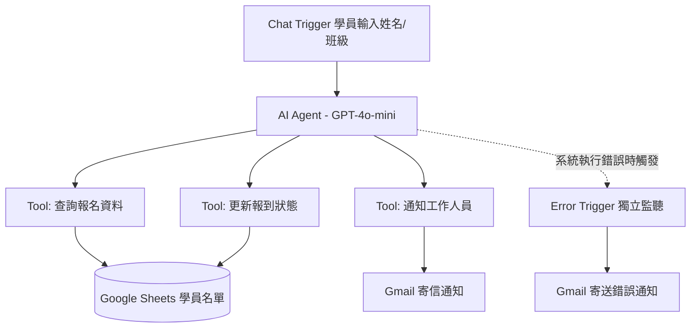

# 系統架構

## 資料流

## 說明

- **Chat Trigger → AI Agent**:學員在 n8n Chat 介面輸入姓名和班級,觸發 AI Agent 開始處理對話
- **AI Agent → 3 個 Tool**:AI Agent 依照 [system prompt](ai-agent-prompt.md) 的流程規則,依序或視情況呼叫「查詢報名資料」「更新報到狀態」「通知工作人員」三個工具,前兩者都是對 Google Sheets 讀寫,最後一個是寄 Gmail
- **Error Trigger 獨立監聽**:不掛在主流程裡,而是獨立的 workflow,監聽 AI Checkin Agent workflow 本身的執行錯誤(例如憑證過期、API 額度用完),錯誤發生時另外寄信通知,跟報到異常通知是兩條分開的路徑
- **資料落地**:學員名單與報到狀態全部存在同一份 Google Sheets,通知信件統一走 Gmail 節點寄出
