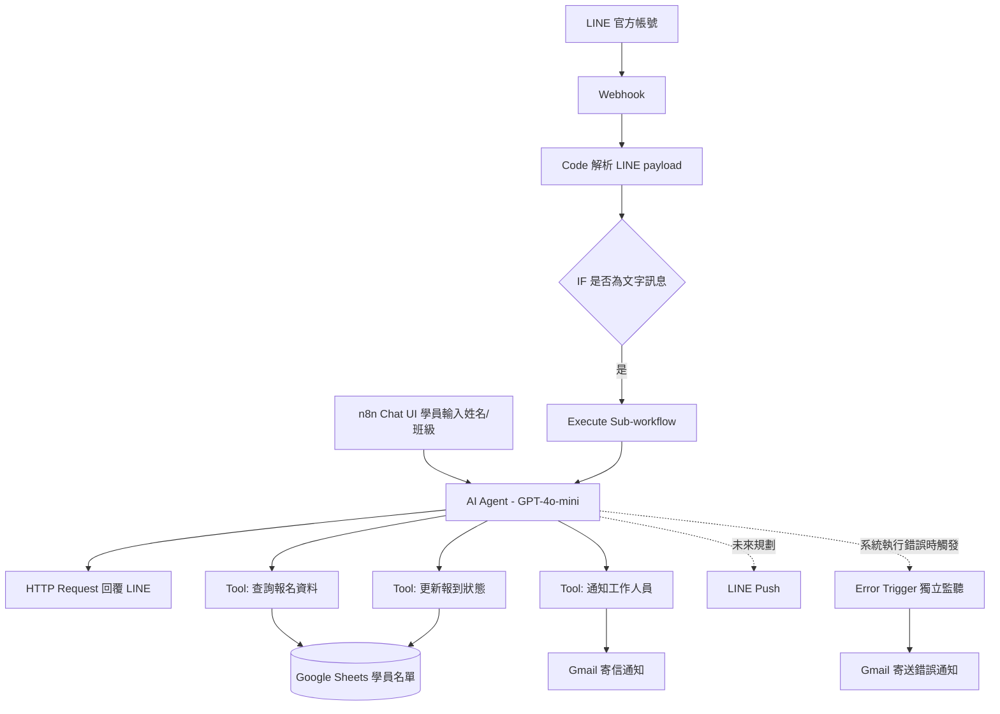

# 系統架構

## 資料流

## 說明

- **兩個入口共用同一個主 workflow**:n8n Chat UI 直接觸發 AI Agent,LINE 那邊則先經過 [LINE Chat Bridge](../workflows/line-chat-bridge.md) 轉換格式,再用 Execute Sub-workflow 呼叫同一個 AI Course Check-in Agent,兩條入口最後跑的是同一套報到邏輯
- **LINE Chat Bridge 節點鏈**:Webhook 收到 LINE 訊息後,Code 節點解析出 userId、訊息內容、replyToken,IF 過濾掉非文字訊息(貼圖、圖片等),再用 Execute Sub-workflow 把訊息丟給主 Agent,拿到回覆後透過 HTTP Request 呼叫 LINE reply API 送回去,細節記錄在 [docs/line-integration-notes.md](line-integration-notes.md)
- **AI Agent → 3 個 Tool**:AI Agent 依照 [system prompt](ai-agent-prompt.md) 的流程規則,依序或視情況呼叫「查詢報名資料」「更新報到狀態」「通知工作人員」三個工具,前兩者都是對 Google Sheets 讀寫,最後一個是寄 Gmail
- **Error Trigger 獨立監聽**:不掛在主流程裡,而是獨立的 workflow,監聽 AI Checkin Agent workflow 本身的執行錯誤(例如憑證過期、API 額度用完),錯誤發生時另外寄信通知,跟報到異常通知是兩條分開的路徑
- **資料落地**:學員名單與報到狀態全部存在同一份 Google Sheets,通知信件統一走 Gmail 節點寄出,LINE Push 主動通知目前還沒做
